# Anexos

### **([R25](https://github.com/rolLangel/yiiaffinity/issues/25)) Codeception**
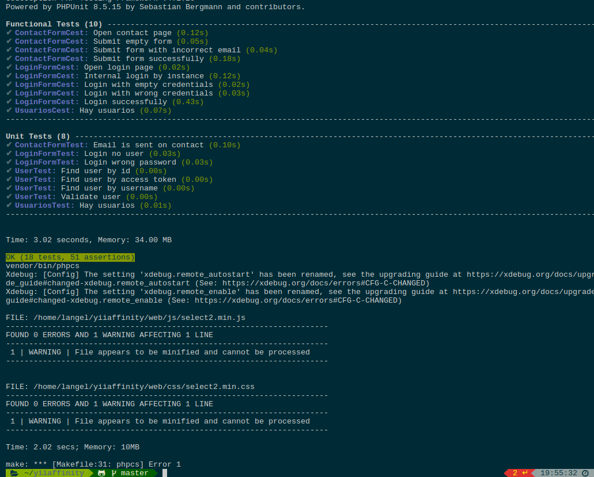

### **([R26](https://github.com/rolLangel/yiiaffinity/issues/26)) Code Climate**
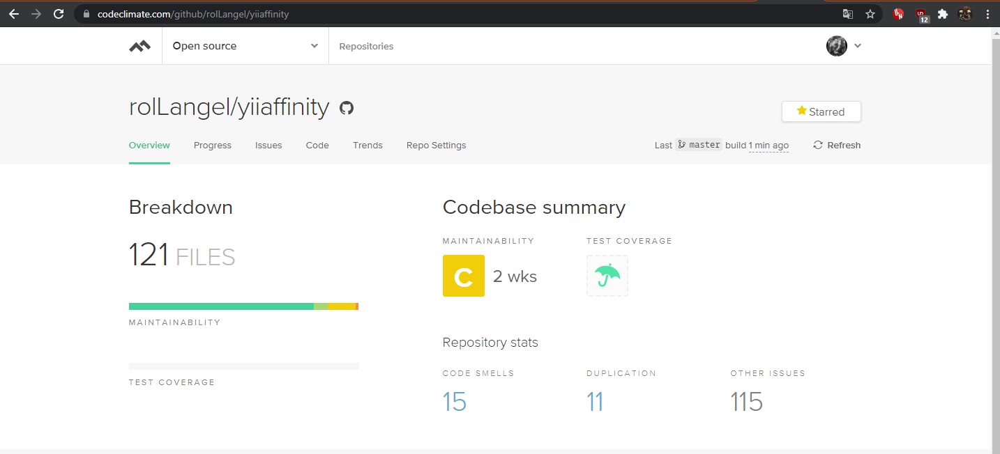

### **([R33](https://github.com/rolLangel/yiiaffinity/issues/33)) Microdatos**

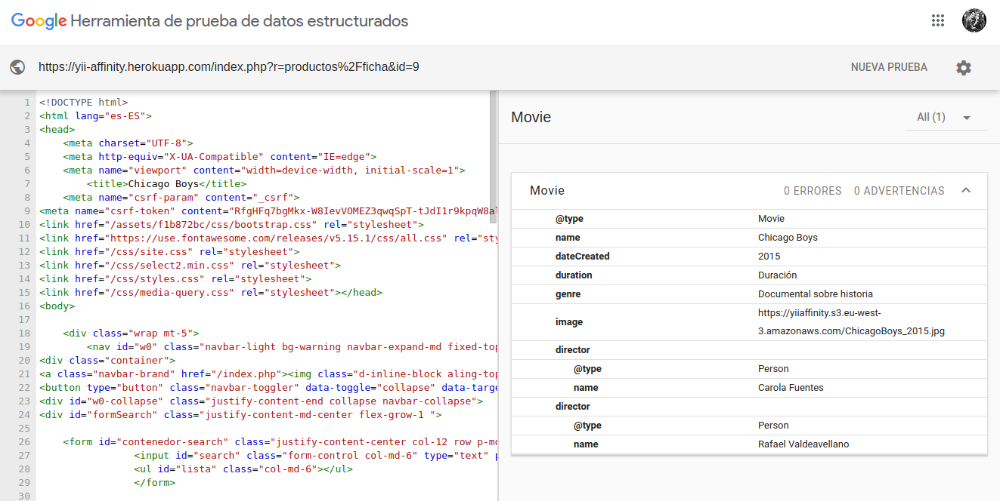

### **([R34](https://github.com/rolLangel/yiiaffinity/issues/34)) Validación HTML5, CSS3 y accesibilidad**
   
* *HTML*
    
    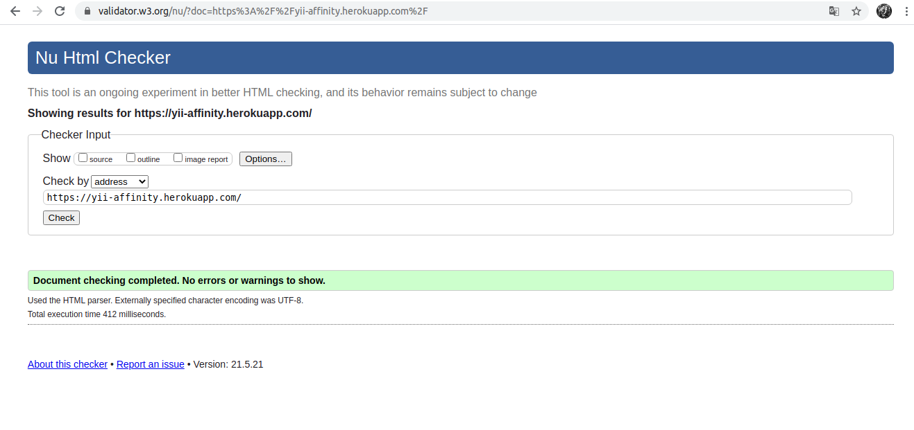

* *CSS*
    
    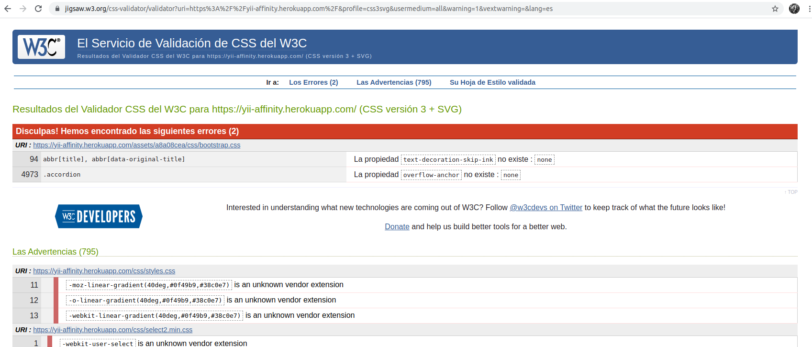

* *Prueba del seis*
    1. ¿Qué sitio es este?

        Al entrar en la aplicación puede verse en el logotipo y en el pie de página el sitio web en el que se encuentra.
       
    2. ¿En qué ṕagina estoy?

        La web cuenta con encabezados que indica donde el usuario está situado, tambien cuenta con la ayudada de la url y las migas de pan.

    3. ¿Cuáles son las principoales secciones del sitio?
    
        La principal seccion son las fichas y las críticas

    4. ¿Que opciones tengo en este nivel?

        En cualquier nivel el usuario tiene acceso a su perfil, sus listas y los usuarios que sigue. A parte tiene un buscador en la parte superior para ir a la ficha que quiera.

        El nivel **mis listas** tiene acceso al nivel **lista** donde los usuarios pueden añadir esas listas a sus listas o eliminarlas de sus listas.
        
        El nivel **Amigos** tiene acceso al nivel de **buscar amigos** donde puede ver usuarios que puede añadir a sus amigos.

        El nivel **perfil** tiene acceso a sus propias **valoraciones**, sus **criticas** y sus **listas**.

        El nivel **ficha** tiene acceso al nivel de **hacer criticas** y ver **criticas** de un producto determinado. 

        *Los anteriores niveles cuentan con un boton de volver al nivel anterior*
    5. ¿Donde estoy en el esquema de las cosas?

        Las migas de pan indican en la parte de la aplicacion en la que está situado el usuario. 

    6. ¿Cómo busco algo?
        
        La aplicación cuenta en todo momento con un buscador de titulos en la parte superior pero en determinadas secciones támbien cuenta con su propio buscador.   

### **([R35](https://github.com/rolLangel/yiiaffinity/issues/35)) Varias resoluciones**
* *Grande*
    
    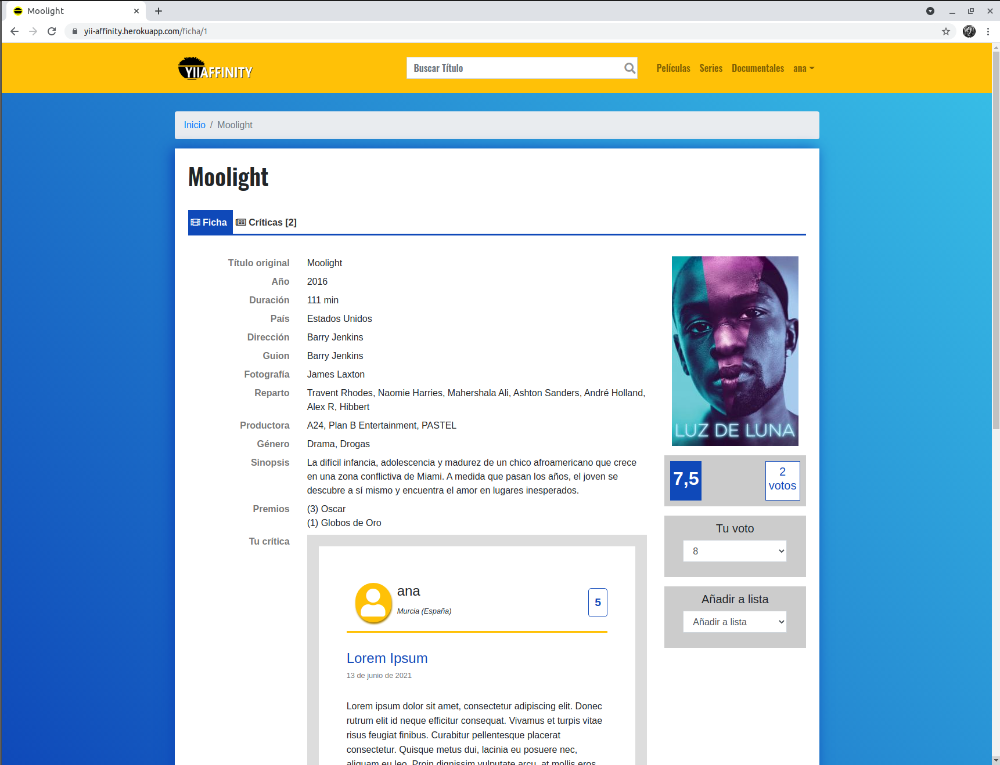

* *Pequeña*
    
    

### **([R36](https://github.com/rolLangel/yiiaffinity/issues/36)) Varios navegadores**
* Edge
    
    

* Firefox 
    
    

* Google Chrome
    
    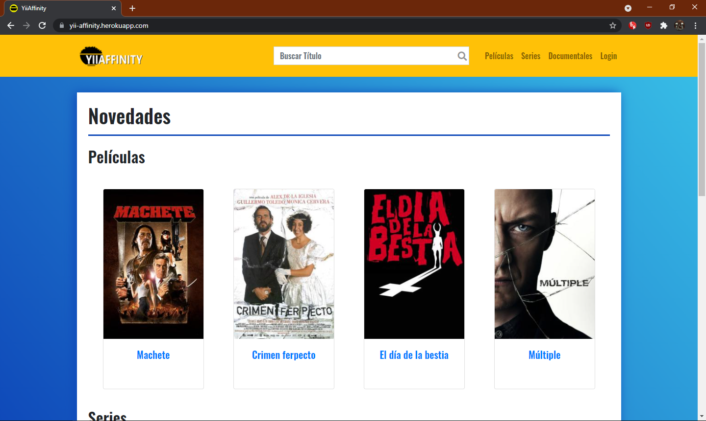

* Opera 
    
    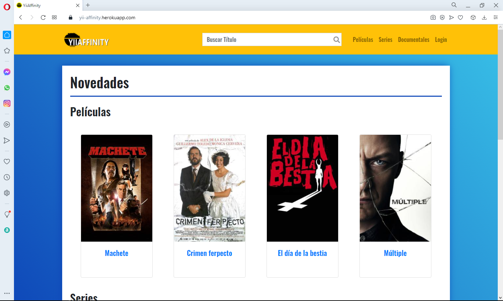

### **([R38](https://github.com/rolLangel/yiiaffinity/issues/38)) Despliegue en un servidor local**

#### **DHCP**

*Configuracion de la red*
* Servidor 

    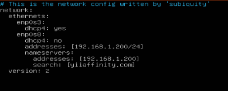

* Cliente

    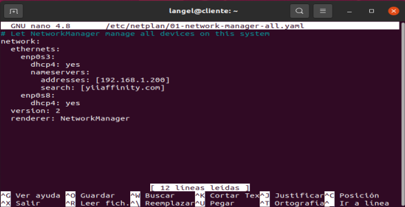

#### **DNS**
 
 * /etc/bind/named,conf.local

    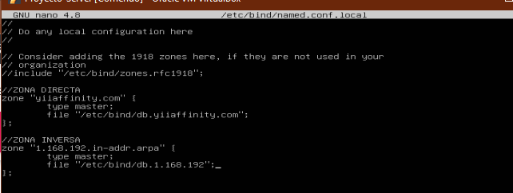

* Zona Directa: /etc/bind/db.yiiaffinity.com

    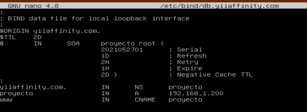

* Zona Inversa: /etc/bind/db.1.168.192

    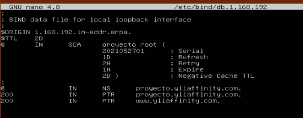

#### **Apache**

*Configuracion del apache*

* /etc/apache2/sites-available/000-default.conf
    
    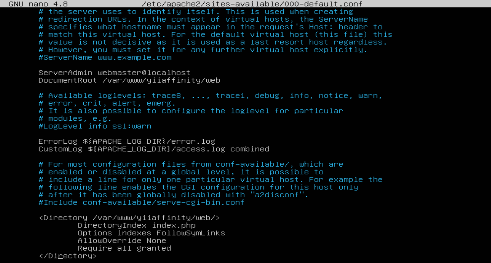

* redireccion https:

    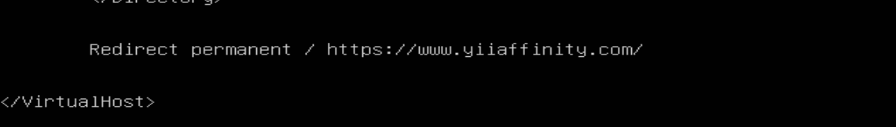

* configuracion mod_speling

  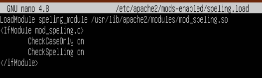

#### *Configuración ssl autofirmada:*

1. Creé la clave privada RSA de 2048 bits
    
    `$ openssl genrsa -out yiiaffinity.key 2048`
2. Generé una solicitud de certificado CSR
    
    `$ openssl req -new -key yiiaffinity.key -out yiiaffinity.csr`

3. Una vez hecho lo anterior creé el certificado autofirmado usando la clave privada
    
    `$ openssl x509 -req -days 365 -in yiiaffinity.csr -signkey yiiaffinity.key -out yiiaffinity.crt`

4. Moví las clave y el certificado a los directorios que usa por defecto apache 

    * `$ sudo mv yiiaffinity.key /etc/ssl/private/`
    * `$ sudo mv yiiaffinity.crt /etc/ssl/certs/`

5. Configuré los permisos
    * `$ sudo chown root:ssl-cert /etc/ssl/private/yiiaffinity.key`
    * `$ sudo chown 640 /etc/ssl/private/yiiaffinity.key`
    * `$ sudo chown root:root /etc/ssl/certs/yiiaffinity.crt`

6. Creé el fichero de configuración  yiiaffinityseguro.conf
    
    `$ sudo nano /etc/apache2/sites-available/yiiaffinityseguro.conf`

7. Habilité el módulo ssl
    
    `$ sudo a2enmod ssl`

8. Habilité el servidor virtual que creé y configuré anteriormente
    
    `$ sudo a2ensite yiiaffinityseguro`

    * Configuración del servidor virtual

        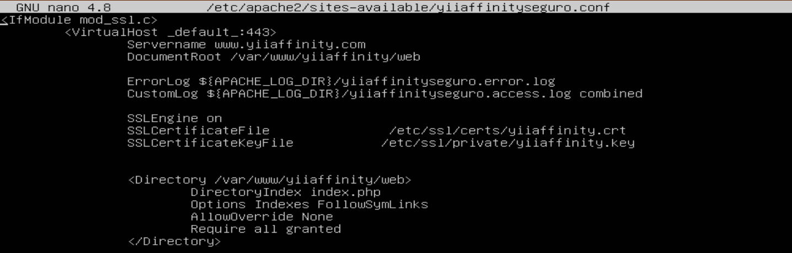
    
**Comprobación:**

1. *speling*
2. *redireccion*
3. *certificado ssl*

    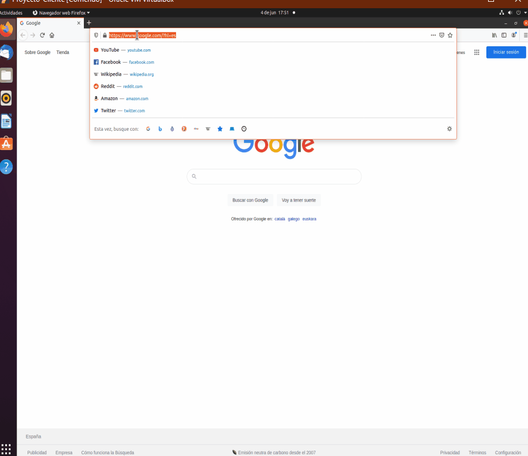

* **Autenticacion Digest:**

    * (uso de alias para acceder a la documentacion)
    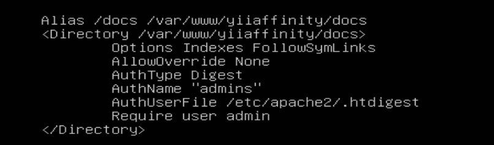

    * Prueba
    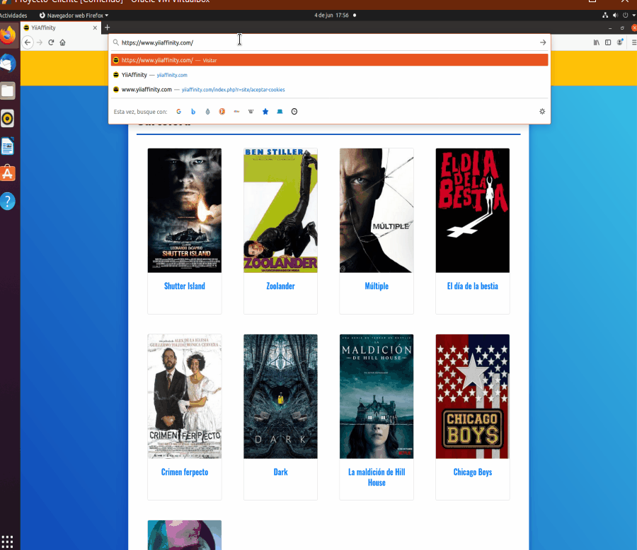

 

#### **Las dos máquinas funcionando**

